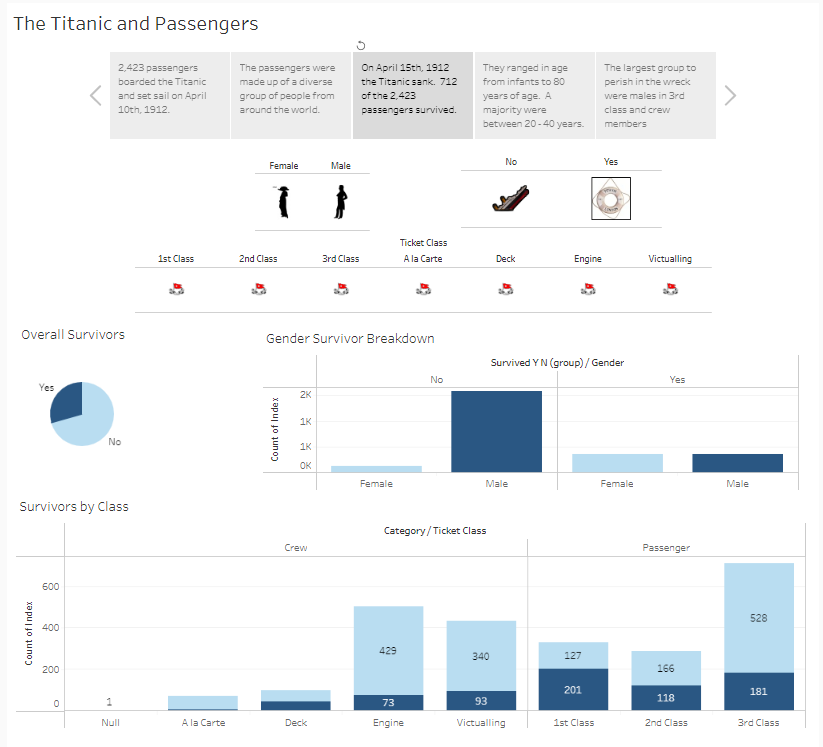

# Survival Rates on the Titanic (Are you a Leo or a Kate?)
### Final Project for Denver University Data Analytics Bootcamp

    

## Topic - Titanic Survivability
There are many mysteries around the Titanic and a lot of information gathered about the people that traveled on the ship’s maiden voyage. Who survived, who did not survive and why? We selected this subject to try to understand some of the "why’s and how’s" around the passengers survivability. Also, history is interesting, and we wanted to do a project that was
* Interesting to all of us
* Had lots of data  
* Historical reference

Our assumption is that the model will predict whether or not someone would survive using demographics that include age, ticket class, and gender.  We also analyzed other passenger demographics to see if they were an impact.  

As an example, someone who worked in the engine room would have a lower survivability rate than a passenger in first class, because they were further away from the lifeboats. Another example is a passenger in third class has a better survivability rate than someone in first class, because the third-class passengers had the grit to survive a tragedy.

## Contributors
Member's Name | Role 
---------|----------
 [Katrina](https://github.com/katrina356) | GitHub & Visualization & Google Slides
 [Sara](https://github.com/sarifrey) | Machine Learning Model & Communication Protocol
 [Shrese](https://github.com/shrese) | Database & README

*All members worked together on each section to ensure accuracy of data, modeling, and information provided to the reader.

## Communication Protocol
Name of Communication | Format | Frequency | Audience | Owner
----------------------|--------|-----------|----------|------
Task Status Update | Slack and T/TH Class Time | 3x a Week | Project Team | All
Project Status Update |	Thursday Class Time |	1 x Week |	TAs |	All
Action Items Follow-up |	Slack and T/TH Class Time |	Saturday of Week Due		
Risks Review and Update |	Tuesday Class Time |	1x Week	Project | Team |	All
Project Communication and Questions |	Project Slack Channel |	Before Pulling Hair Out; So, after no more than 20 Minutes of Frustration |	Project Team |	All
Wits End Project Communication and Questions |	Titans Slack Channel |	As Needed |	TAs	 | All

## Initial questions for consideration
1. How do the following impact survival rates?
    * Age
    * Adult vs. Child
    * Ticket Class
    * Passenger vs. Crew
    * By size of their party traveling
    * By country
    * Gender
    * Embarked
    * By servant vs. employer
2. What was the average cost of ticket in 2021?
    * Cost by class compared to today
3. What was the class fare structure?
4. How long did people survive after by class, etc.?

## External Presentations
* [Google Presentation](https://docs.google.com/presentation/d/1s3Yb2CB7xHdOnEonHknPmTtLHNYMpXDFo4cBXckvWIc/edit#slide=id.p)
* [Tableau](https://public.tableau.com/app/profile/katrina.holcomb/viz/Titanic_Prelim_V2/TheTitanicandPassengers)

## Technology and Analytic Tools
* Excel to obtain initial datasets in .csv format.
* QuickDBD to organize our tables.
* PGAdmin to build the DataFrame via PostgreSQL.
* Jupyter Notebook for the machine learning.
* Tableau for visualization and interactivity.  

## Data Exploration
Several sites were reviewed for datasets.  These included Kaggle, Data is Plural, and Encyclopedia Titanica.  The Encyclopedia Titanica site had the most valuable dataset and three tables were utilized.  The table reviewed from Data is Plural was also used. 

Four files were chosen in .csv format.  We reviewed the raw data in order to decide which information we needed and how it needed to be cleaned.  We combined the data into one DataFrame using PGAdmin, and Jupyter Notebook was used for the machine learning utilizing Pandas and Matplotlib.  

## Database
After the decision was made on the datasets, PostgreSQL via PGAdmin was used to build the DataFrame.

Cleaning Steps
* Removed special characters from names.
* Relaced strings in age with numerical data. 
* Created unique identifiers so that the files could be combined.
* Removed any columns not needed for the analysis.

Database Creation Steps:
* Used ERD to create a schema of the data, showing how the data is organized and connected via QuickDBD.  

* Utilized the ERD tables to build in PostgreSQL. 
* Imported original dataset to PostgresSQL.
* SQL queries were written to make the data more usable and complete.  
    * Column names were changed as PGAdmin would not allow the original name, because they were functions within the SQL language.
    * The NULL values in the survived_y_n was replaced with 0.
        * survived = 1
        * not survived = 0
    * Removed passengers and crew members that were not on the Titanic when it hit the iceberg.
* SQL queries combined the four datasets into the final dataset. 
* The combined data was exported into the DataFrame used for analysis. 

The biggest challenge to the data was understanding how the data worked and how to connect the files.  The first thought was the passenger names might be the way to connect the data; however, it was discovered that the names were not consistent across all datasets.  The data required that each name have its own index so that the data could be connected.

## Machine Learning Model
The RandomForestClassifier was initially utilized for this analysis to predict who survived the Titanic disaster.

Steps Taken:
* Explore the data. See what is available. 
    * Install the Panadas_Profiling package.
    * Tied charts using the Seaborn_Library after seeing the results in the Kaggle Titanic dataset.  
    * Create charts on survivability based on factors: age, gender, and ticket class.
* Look at the baseline model. (Suggested in the Titanic dataset writeups.  The Kaggle Titanic dataset baseline for the women surviving is 70 percent.) 
* Code machine learning algorithms.  
    * In the preprocessing, transformed data
    * Removed data not used or not informing survivability.
    * Ran Random Forest Classifier
    * Created and ran confusion matrix

How data was used:
Data | Training | Testing | To Numeric
---------|:----------:|:---------:|:---------:
gender^ | x | x | x | 
ticket_class^ | x | x | x | 
age | x | x |  | 
marital_status | x | x | x | 
category | x | x | x | 
embarked | x | x | x | 
country_of_residence | x | x | x |  
sibsp¶ | x | x |  | 
parch¶ | x | x |  | 
fare† | x | x |  | 
survived_y_n†† | | x | | 

Any unlisted columns from the DataFrame were removed.  
^ Gender and ticket_class are the primary features for determining survivability on the Titanic.  
¶ Sibsp and Parch denote how many siblings/parents were on board.  
† Fare is a sub feature based on ticket_class.  
†† The feature “survived_y_n” was removed from the training to test the accuracy.  
 
___
Features by importance:  
    (0.30503702309593206, 'age'),  
    (0.2139435376173998, 'gender'),  
    (0.11452194680648929, 'ticket_class'),  
    (0.1023419958134857, 'fare'),
___
The RandomForestClassifier resulted in a 94% accuracy; however, the results of the Confusion Matrix are poor at 78%.  Overall, the numbers are okay. The f1-score is high enough. Precision is decent for non-survivors with correctly prediction of 81%; however, it is only 69% survivors.

___
During the research and analysis of the modeling process, Pandas profiling was discovered as a tool to view the overall statistics of the data.  It is visually more appealing and interactive.  

## Interactive Dashboard
Tableau was utilized for the interactive portion of the project.  An interactive story board was created to see if we could answer all the questions that were discussed at the start of the project.  We looked to tell a story about the people who were on the Titanic and survivability rates based on different passenger/crew demographics.

Formatting the story board was a challenge for the team.  There was time spent building the dashboard and then researching how to make it look professional.

## Conclusion
### Results:
There were 2,433 passengers and crew on the Titanic at the time of the sinking. There were only 20 lifeboats that had the capacity to carry a total of 1,178 people, or about half the passengers. The ship was built to carry up to 64 boats.  Only 712 people that survived the shipwreck, or 30% of the passengers. This left a lot of empty space on the boats and not enough room for everyone. 

When looking at the data we discovered that approximately the same number of men (353) survived compared to women (359).  The number of people that survived across the three ticket classes were relatively the same.  However, as a percentage more women survived (72%) than men (18%).  Ticket class had the same results as a percentage.

These statistics would lead you to believe that the gender and ticket class would be good predictors of whether or not you would survive the shipwreck.  However, the model was unable to predict survivability as the accuracy rate of the Random Forest Classifier was 95% and predictability was only at 78%.  The other demographics considered were also not predictors of survivability.

Our conclusion is that the demographics of the passenger and crew members are not prediction indicators of survivability.  

There were not enough boats, too many people, and there was total chaos.

An interesting fact not related to the analysis is that the price of the tickets was exorbitant. The fares ranged from £3.17 to £512.33.  The average was £30.93, which equates to £3,710.34 in 2021 (or $4,976.13)  

### Future Recommendations:
The Pandas Profiling was an interesting discovery that can be explored in future analysis.

While the data from the Kaggle challenge was very clean, we wanted to challenge ourselves with multiple sources of data that was not in an ideal state.  This gave us good experience in the cleaning of the data.  It did give us a lot more data than necessary and did not find anything different from what the clean Kaggle data gave us.  This also muddied the waters a bit causing us to go into a rabbit hole and have analysis paralysis.  It would be good in the future to look at the data set and only use what you think would be predictors.  Then if it did not work as expected, you can add additional information.  

We looked at how long the survivors lived after the tragedy.  It would be interesting to compare that to life expectancies of that time.

## Sources:  
[Encyclopedia Titanica](https://www.encyclopedia-titanica.org/)   
[Data is Plural](https://www.data-is-plural.com/archive/2016-03-30-edition/)   
[Pandas Profiling](https://github.com/pandas-profiling/pandas-profiling/blob/develop/README.md#command-line-usage)  
[Machine Learning Code - activestate](https://www.activestate.com/blog/how-to-use-machine-learning-to-determine-titanic-survivors/)  
[Machine Learning Code - betterprogramming](https://betterprogramming.pub/titanic-survival-prediction-using-machine-learning-4c5ff1e3fa16)  
[RandomForestClassifier](https://towardsdatascience.com/predicting-the-survival-of-titanic-passengers-30870ccc7e8)  
[Kaggle Titanic Test/Train Dataset](https://www.kaggle.com/c/titanic/data)  
[QuickDBD](https://www.quickdatabasediagrams.com/)  
[CPI Inflation Calculator](https://www.in2013dollars.com/uk/inflation/1912)
