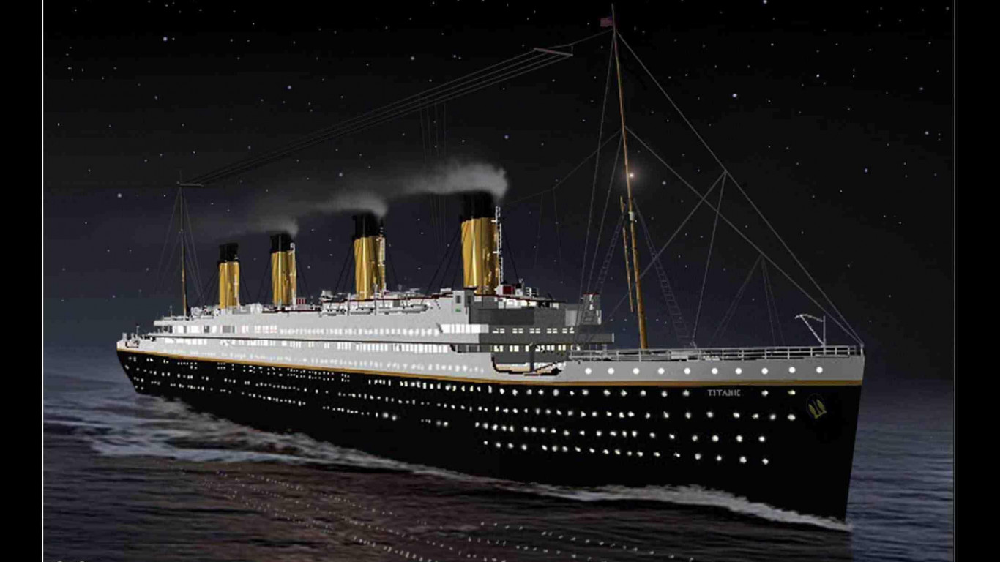
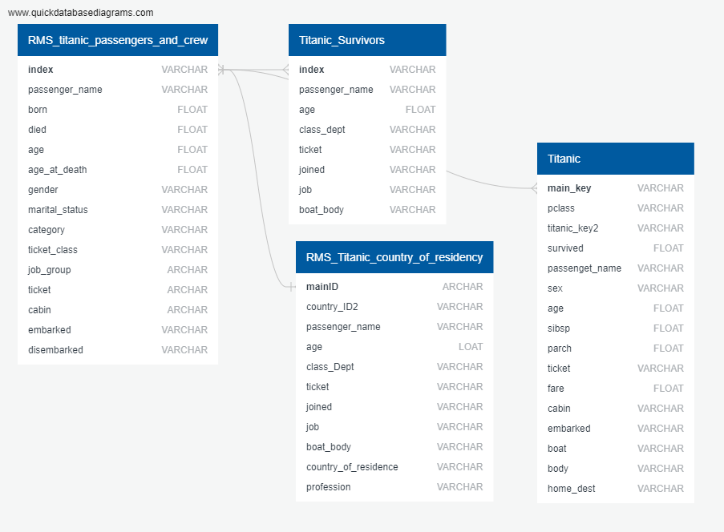
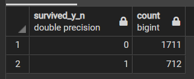
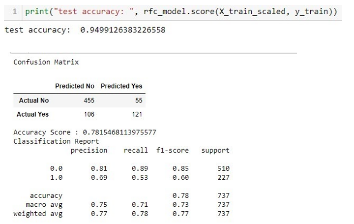
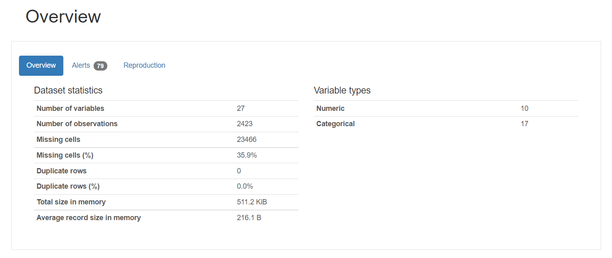

# Survival Rates on the Titanic (Are you a Leo or a Kate?)
Final Project for Denver University Data Analytics Bootcamp

    

## Topic - Titanic Survivability
There are a lot of mysteries around the Titanic. Who survived, who did not survive and why? We selected this subject to understand some of the "whys" around the passengers survivability. Also, history is interesting, and as a team we wanted to do a project that was
* Interesting to all of us
* Had lots of data  
* Historical reference

During this exploratory phase  we learned that we all have a passion for history and for diving into data.

By analyzing demographic around the passengers and crew of the Titanic, the model will be able to predict whether or not someone would survive based on age, ticket class, gender, and fare.

As an example, someone who worked in the engine, would have a less ability to survive than someone in first class. Or, someone who is in third class might survive over someone in first class, because they had a grit to survive a tragedy, while a first-class passenger might think that they are too good to go in the boat or someone one will be along soon to save them.

## Contributors
Member's Name | Role 
---------|----------
 [Katrina](https://github.com/katrina356) | Dashboard & Visualization 
 [Sara](https://github.com/sarifrey) | Machine Learning 
 [Shrese](https://github.com/shrese) | Database 

*All members worked together on each section to ensure accuracy of data, modeling, and information provided to the reader.

## Communication Protocol
Name of Communication | Format | Frequency | Audience | Owner
----------------------|--------|-----------|----------|------
Task Status Update | Slack and T/TH Class Time | 3x a Week | Project Team | All
Project Status Update |	Thursday Class Time |	1 x Week |	TAs |	All
Action Items Follow-up |	Slack and T/TH Class Time |	Saturday of Week Due		
Risks Review and Update |	Tuesday Class Time |	1x Week	Project | Team |	All
Project Communication and Questions |	Project Slack Channel |	Before Pulling Hair Out; So After no more than 20 Minutes of Frustration |	Project Team |	All
Wits End Project Communication and Questions |	Titans Slack Channel |	As Needed |	TAs	 | All

## Initial questions for consideration
1. How do the following impact survival rates?
    * Age
    * Adult vs. Child
    * Ticket Class
    * Passenger vs. Crew
    * By size of their party traveling
    * By country
    * Gender
    * Embarked
    * By servant vs. employer
2. What was the average cost of ticket in 2021?
    * Cost by class compared to today
3. What was the class fare structure?
4. How long did people survive after by class, etc.?

## External Presentations
* [Google Presentation](https://docs.google.com/presentation/d/1s3Yb2CB7xHdOnEonHknPmTtLHNYMpXDFo4cBXckvWIc/edit#slide=id.p)
* [Tableau](https://public.tableau.com/app/profile/katrina.holcomb/viz/Titanic_Prelim_V2/TitanicFinal?publish=yes)

## Technology and Analytic Tools
* Excel to obtain initial datasets in .csv format.
* PGAdmin to build the DataFrame via PostgreSQL.
* Jupyter Notebook for the machine learning.
* Tableau for visualization and interactivity.  

## Data Exploration
Several sites were reviewed for datasets.  These included Kaggle, Data is Plural, and Encyclopedia Titanica.  The Encyclopedia Titanica site had the most valuable information, and three tables were utilized.  The table reviewed from Data is Plural was also used. 

Six sources of data were chosen from these sites.  We reviewed the raw data in order to decide which information we need to utilize from which datasets.  This helped us understand whether we need all or only some of the datasets.

The datasets were pulled from our final chosen site, Encyclopedia Titanica in .csv format.  These files were connected to Jupyter Notebook through SQLAlchemy. The data in these files were analyzed to see the dataypes, how it might be used and how it should be cleaned.

## Database
Once a decision was made on the datasets, it was decided to use PostgreSQL via PGAdmin to build the DataFrame.

Steps Taken:
* Created a schema of the data via an ERD showing how the data is organized and connected via [QuickDBD](https://www.quickdatabasediagrams.com/).  

* Utilizing the ERD tables were built in PostgreSQL. (table_creation.slq)
* The original dataset was imported to PostgresSQL.
* SQL queries were written to make the data more usable and complete.  
    * Some of the column names were changed as PGAdmin would not allow the original name, because they were functions within the SQL language.
    * The NULL values in the survived_y_n were replaced with 0.
        * survived = 1
        * not survived = 0
    * Removed any passengers and crew members that were not on the ship when it hit the iceberg.
    * Removed any special characters from names.
    * Relacing strings in age with numerical data. 
* SQL queries were used to combine the four datasets into the final dataset. (sql_statement.sql)
* The combined data was exported into the DataFrame used for analysis. (RMS_Titanic_Final_DataFrame.csv)  

The biggest challenge to the data was understanding how the data worked and how to connect the files.  The first thought was that the names might be the way to connect the data; however, it was discovered that the names were not consistent across all datasets.  The data required that each name have it's own index so that the data could be connected.

## Machine Learning Model
The RandomForestClassifier was initially utilized for this analysis to predict who survived the Titanic disaster.

Steps Taken:
* Explore the data. See what is available. 
    * Install the Panadas_Profiling package.
    * Tied charts using the Seaborn_Library after seeing the results in the Kaggle Titanic dataset.  
    * Create charts on survivability based on factors: age, gender, and ticket class.
* Look at the baseline model. (Suggested in the Titanic dataset writeups.  The Kaggle Titanic dataset baseline for the women surviving is 70 percent.) 
* Code machine learning algorithms.  
    * In the preprocessing, transformed data
    * Removed data not used or not informing survivability.
    * Ran Random Forest Classifier
    * Created and ran confusion matrix

How data was used:
Data | Training | Testing | To Numeric
---------|:----------:|:---------:|:---------:
gender^ | x | x | x | 
ticket_class^ | x | x | x | 
age | x | x |  | 
marital_status | x | x | x | 
category | x | x | x | 
embarked | x | x | x | 
country_of_residence | x | x | x |  
sibsp¶ | x | x |  | 
parch¶ | x | x |  | 
fare† | x | x |  | 
survived_y_n†† | | x | | 

Any unlisted columns from the DataFrame were removed.  
^ Gender and ticket_class are the primary features for determining survivability on the Titanic.  
¶ Sibsp and Parch denote how many siblings/parents were on board.  
† Fare is a sub feature based on ticket_class.  
†† The feature “survived_y_n” was removed from the training to test the accuracy.  
 
___
Features by importance:  
    (0.30503702309593206, 'age'),  
    (0.2139435376173998, 'gender'),  
    (0.11452194680648929, 'ticket_class'),  
    (0.1023419958134857, 'fare'),

___
Age + survived_y_n + category returns that the younger people, especially crew members did not survive.
___

The RandomForestClassifier resulted in a 94% accuracy; however, the results of the Confusion Matrix is poor at 78%.  Overall, the numbers are okay. The f1-score is high enough. Precision is decent. SHOULD WE SAY WHY PRECISION IS DECENT?

___
Pandas Profiling - During the research and analysis of the modeling process, Pandas profiling was discovered as a great way to view the overall statistics of the data.  It is visually more appealing and interactive. 

## Interactive Dashboard
Tableau was utilized for the interactive portion of the project.  A story board was created to see if we could answer all the questions that were discussed at the start of the project.  We looked to tell a story about the people who were on the Titanic and survivability rates based on different passenger/crew demographics.

IMAGE

## Conclusion
### Results:

What is the model telling us that we predict survivablity?
* better chance of survive if female
* What does age really tell us?
* Ticket class and fare are related with similar importance at ~10%

What does the model not tell us?

give best interpretation of what the model suggests

As number of survivors a relativemen and women 
Women and children survived with the detrmining factor 

If you are woman you are 73% likely to survive 
survior rate for women (including children)
18% of the men survived
48% of children survived

there were 2423 people of which 712, or 29% survived

The average age is very young which skews the ability to survive. is this feature skewed because of the age. the majority are between 15-35, and very few over 75.

do a whiskers chart?

### Future Recommendations:

## Sources:  
[Encyclopedia Titanica](https://www.encyclopedia-titanica.org/)   
[Data is Plural](https://www.data-is-plural.com/archive/2016-03-30-edition/)   
[Pandas Profiling](https://github.com/pandas-profiling/pandas-profiling/blob/develop/README.md#command-line-usage)  
[Machine Learning Code - activestate](https://www.activestate.com/blog/how-to-use-machine-learning-to-determine-titanic-survivors/)  
[Machine Learning Code - betterprogramming](https://betterprogramming.pub/titanic-survival-prediction-using-machine-learning-4c5ff1e3fa16)  
[RandomForestClassifier](https://towardsdatascience.com/predicting-the-survival-of-titanic-passengers-30870ccc7e8)  
[Kaggle Titanic Test/Train Dataset](https://www.kaggle.com/c/titanic/data)